# Lab 2: OWASP Juice Shop

Owasp Juice shop is a web application designed to be insecure and is used for practising exploiting vulnerabilities. This will teach the more practicial elements of cyber security like SQL Injections, executing Cross Site Scripting.

## Exercise 1:

Figure 27 - Find Carefully Hidden Scoreboard

### Step 1: Go on inspect, click on the sources tab, select main.js and type in “path” one of the results should be the score-board

Figure 28- Path Found for Scoreboard

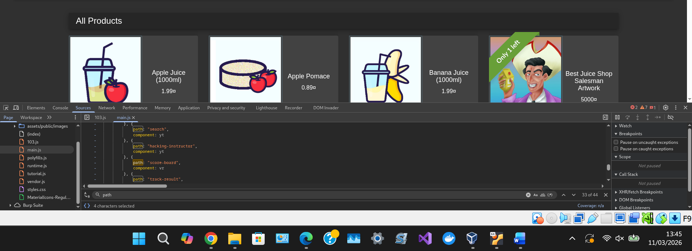

### Output: When you add “/score-board” to the url, you will be taken to the scoreboard and juice shop will tell you that the challenge has been completed.

Figure 29 - URL Contains "Score-board"

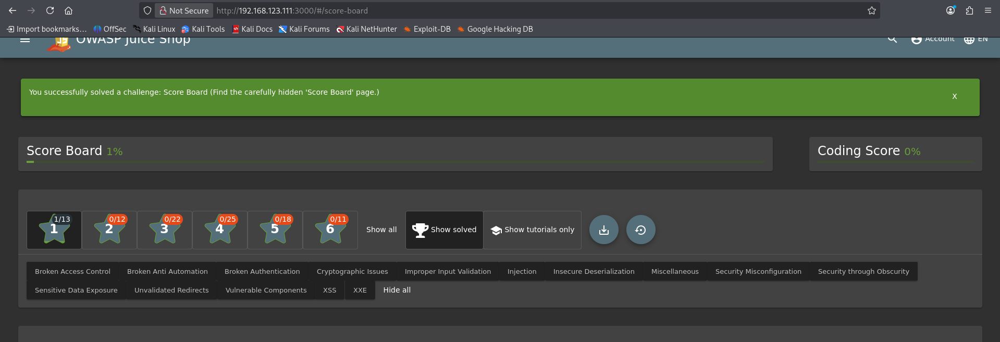

Figure 30 - Challenge Completed

## Exercise 1 CIA Triad Impact

| Confidentiality - Breached | Integrity – Indirect Risk | Avaliability - Minimal |
| --- | --- | --- |
| Hidden Internal routes are exposed to users who are not logged in | Discovering hidden routes enables further attacks especially if admin routes are found. | Not much risk |

## Challenge 2: Create New Admin User

Figure 31 - Create New Admin User Challenge (3 Star)

### Step 1: Create new user on the Register page

Figure 32 - Registering an New User

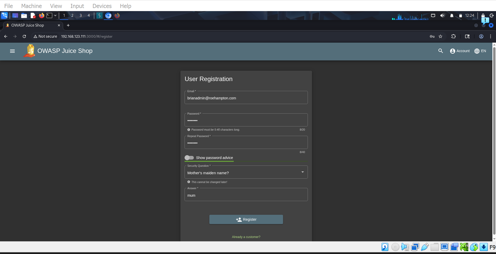

### Step 2: Ensure Burpsuite got the Request for login

Figure 33 - Burpsuite Got the details we Entered

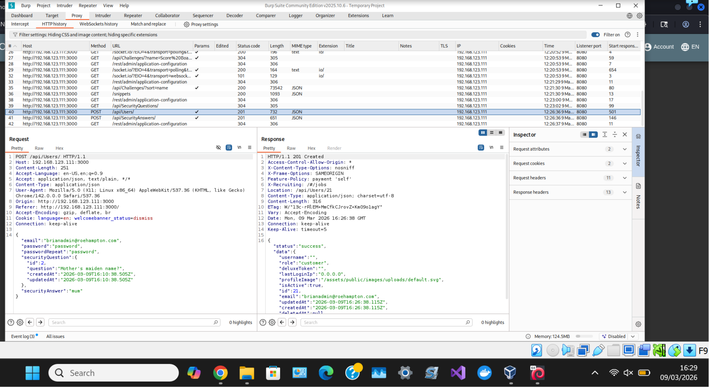

### Step 3:

Copy request to repeater, change the email and add a field called “role”. In that role enter admin. The “role” field is used to determine the access level of a user.

Figure 34 - "Role: admin" has been added

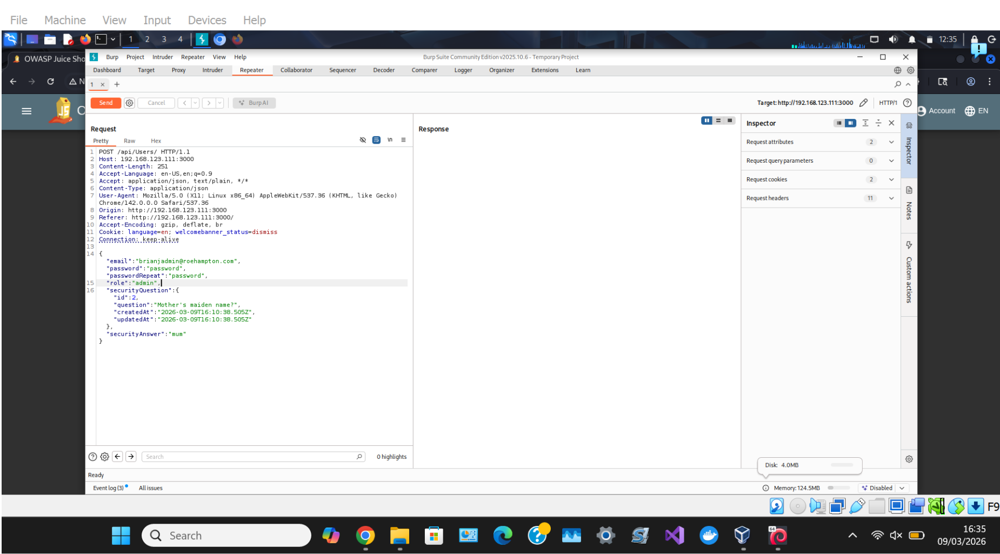

### Step 4: Once “Repeat” is pressed, your new account should be updated to admin because we changed the role from “customer” to “Admin”

Figure 35 - New User has the role "Admin

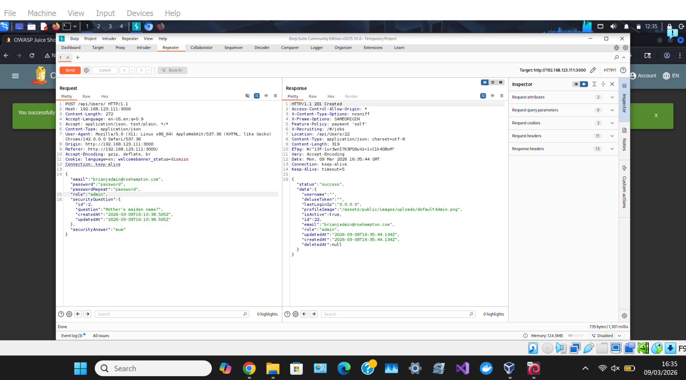

### Proof of completion

Figure 36 - Challenge 2 Completed

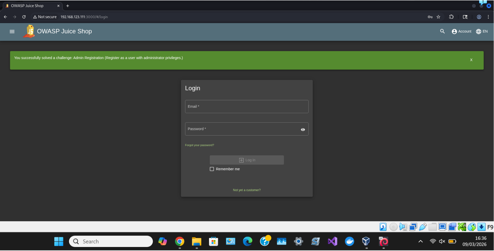

Figure 37 - New Admin User "brianadmin@roehampton.com" has been created

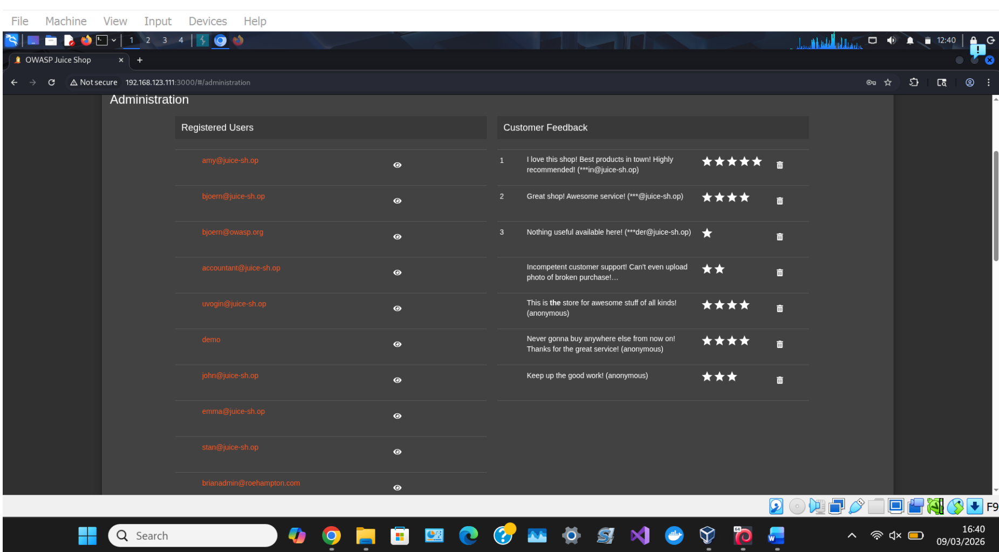

## Exercise 2 CIA Triad Impact

| Confidentiality - Breached | Integrity – Breached | Avaliability – High Risk |
| --- | --- | --- |
| Gaining admin access exposes registered user emails, hashed passwords and order history. | As an authenticated admin, the attacker can modify user and product data which would erode the trust of available data | An admin account could be used to delete all products or corrupt the database schema |

## Challenge 3: Find Admin Page

Figure 38 - Acess Admin Challenge Completed

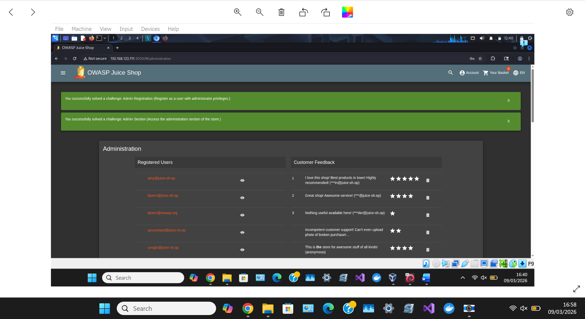

## Exercise 3 CIA Triad Impact

| Confidentiality - Breached | Integrity – At Risk | Avaliability – at risk |
| --- | --- | --- |
| Gaining admin access exposes registered user emails, hashed passwords and order history. | As an authenticated admin, the attacker can modify user reviews and product reviews | Administrator controls could be used to lock out customers |

## Challenge 4:

Figure 39 - Challenge 4: View Another Users Basket

### Step 1: Login to an account, go to the basket page and open up session tab with the inspect tab open.

Figure 40 - Inspect Tab open with the Basket ID

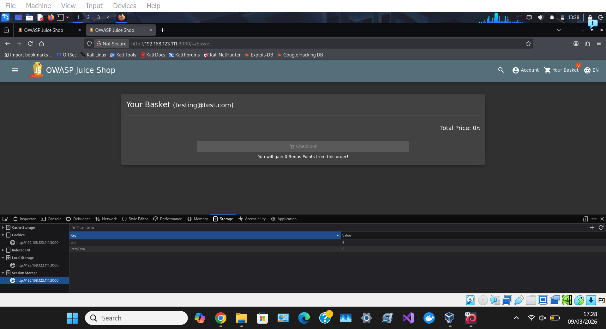

### Step 2: Change the Basket ID(bid) to another number like 1 or 2. After that reload the page.

Figure 41 - Basket ID Changed to "2"

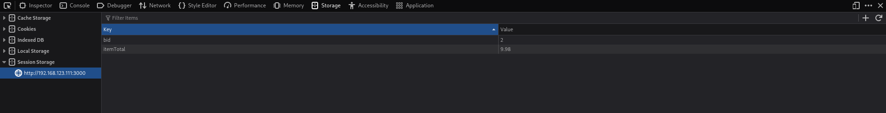

### Output (This shows another customers purchase details which consists of 2 orders of raspberry juice. The limitation of this is that it does not give more details such as the user who ordered it which if it did then a hacker could have made phishing page and send an email to the user explaining that something is wrong with their order.)

Figure 42 - Challenge completed and someone else’s basket is displayed

### Output (This shows another customer’s purchase detail with BasketID 5)

Figure 117 - BasketID 5 purchase details from another customer account

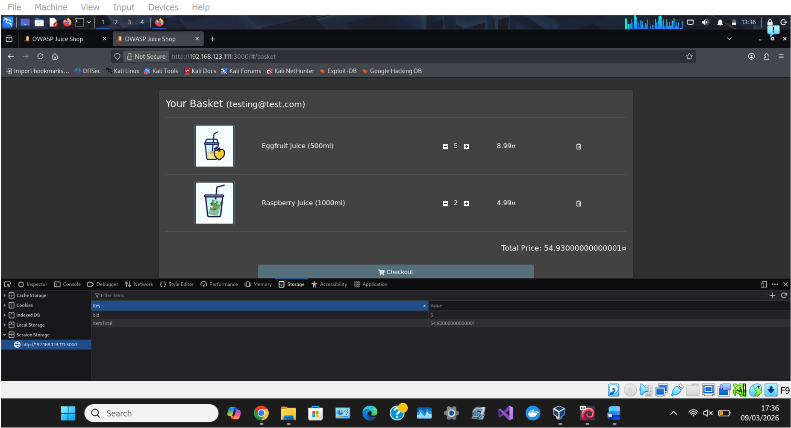

## Exercise 4 CIA Triad Impact

| Confidentiality - Breached | Integrity – At Risk | Avaliability – Minimal |
| --- | --- | --- |
| Another Customers order details are exposed | If its possible to edit the basket, attackers could add or remove items. | The attack does not directly disrupt availability  |

## Challenge 5: 

Figure 43 - Challenge 5: Login As Admin

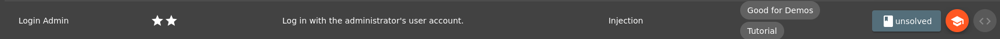

### Step 1:

Attempt to login as a admin by guessing the email and password once

Figure 44 - Unsuccessful log in using "admin user"

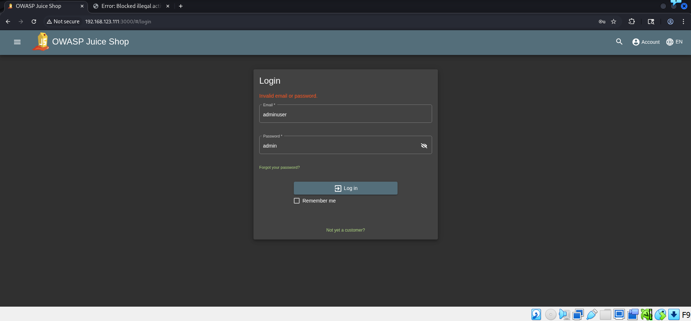

### Step 2: Ensure the login request is received by burpsuite and send it to repeater.

Figure 45 - Username and password recorded

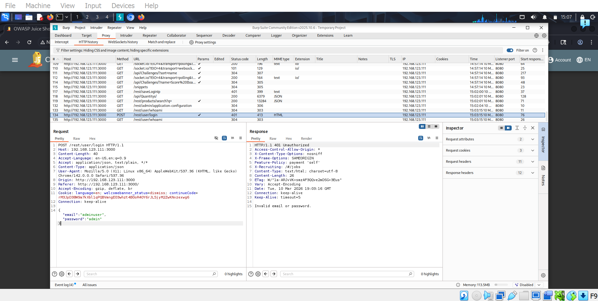

### Step 3: Commit a SQL injection in the email section “adminuser” or 1=1 –"

Figure 46- Sql Injection in the Repeater

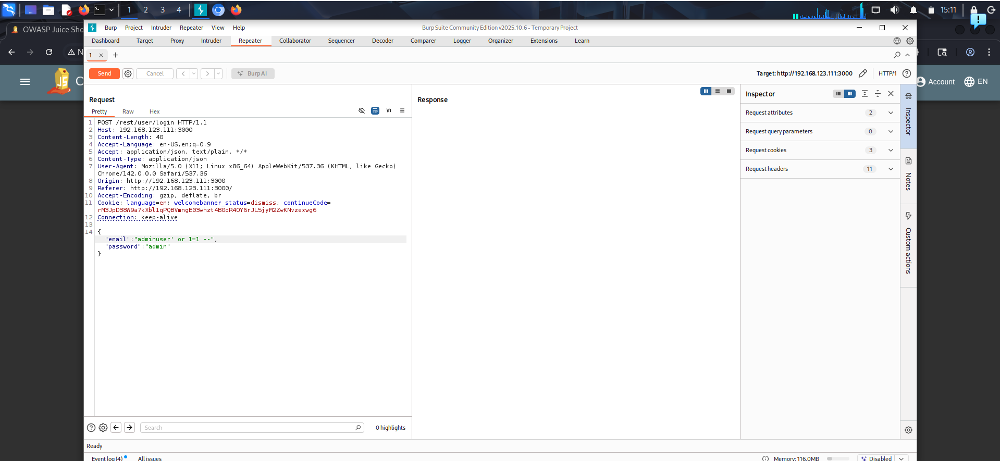

### Output of the sql Injection with a generated authentication token, basket id and email  showing that we have been granted access and Proof of Completion.

Figure 47 - Successful Authentication and Token Recieved

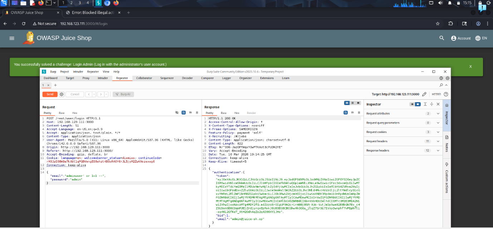

	

## Exercise 5 CIA Triad Impact

| Confidentiality - Breached | Integrity – At Risk | Avaliability - Indirect |
| --- | --- | --- |
| Gaining admin access exposes registered user emails, hashed passwords and order history. | As an authenticated admin, the attacker can modify user and product data which would erode the trust of available data | The attack does not directly disrupt availability but an admin account could be used to delete all products |

## Challenge 6: 

Figure 48 - Challenge 6: Provoke an Error that is not Handled Gracefully

### Step 1:

As a logged in user that you have created, Try and go to the profile page by clicking the profile icon

Figure 49 - Profile Icon

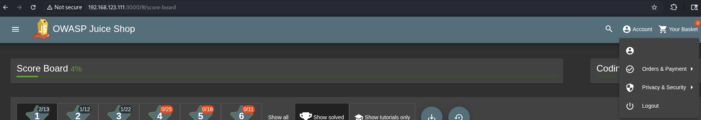

### Step 2: This page should come up showing that the request was not handled gracefully thus completing the challenge

Figure 50 - Unhandled error and it shows the Programming language being used

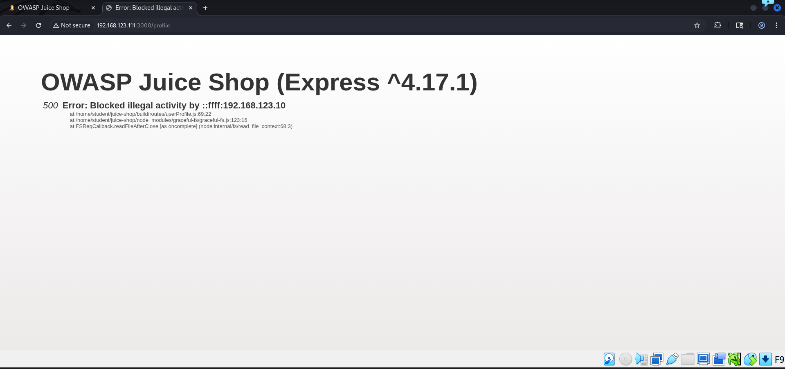

### Proof of completion

Figure 51 - Challenge Completed

## Challenge 6 CIA Triad Impact

| Confidentiality - Breached | Integrity – At Risk | Avaliability - Indirect |
| --- | --- | --- |
| Internal file path, source file name and language used have been exposed | Knowing the framework version could let an attacker look up known vulnerabilities and use payloads | Unhandled execetptions that cause crashes could cause the software to go down. |

## Challenge 7:

Figure 52 - Challenge 7: Login Bender

### Step 1: Go to the product page and look through the reviews of all products to find a review left by benders email address.

Figure 53 - A review left by bender on the Banana Juice product

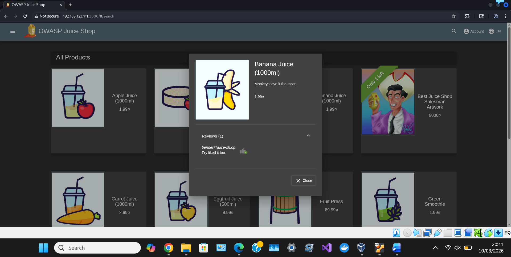

### Step 2: Commit SQL Injection in the email section of the login page by typing “- -". You can put any value in the password section.

Figure 54 - Sql Injection

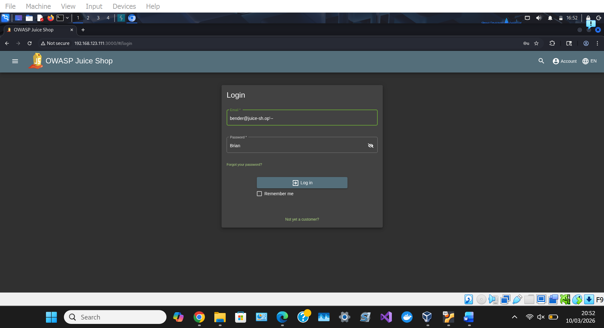

### Proof of completion

Figure 55 - Challenge Completed

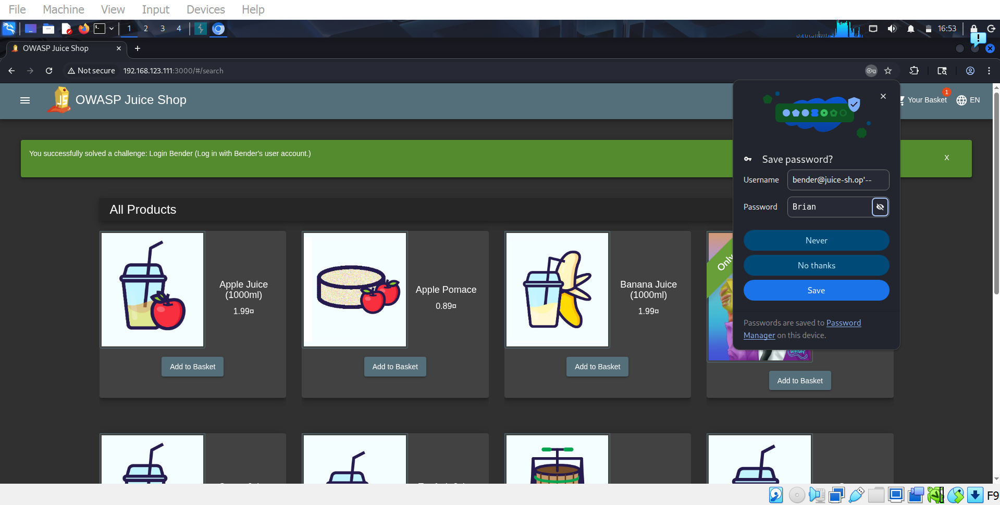

Figure 56 - Logged in as Bender

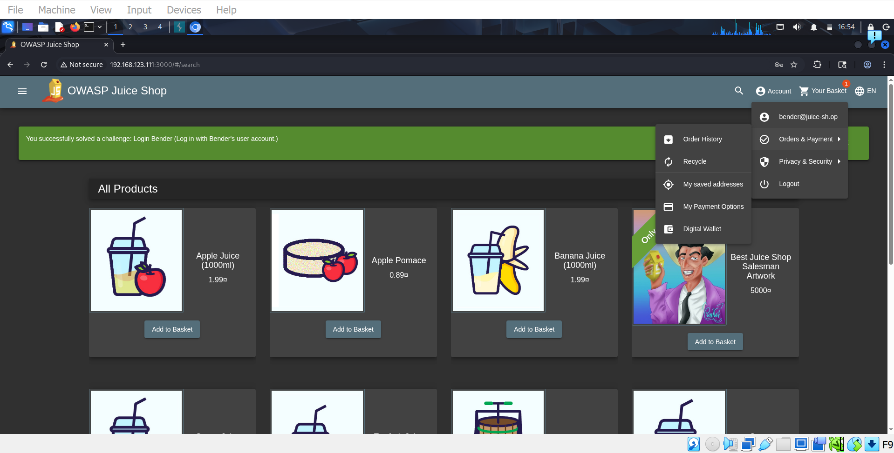

## Challenge 7 CIA Triad Impact

| Confidentiality - Breached | Integrity – Breached | Avaliability - Risk |
| --- | --- | --- |
| Complete takeover of account allowing access to users personal data. | Attacker could make unauthorised purchases, reviews or change details | Attacker can change users login details and lock them out |

## Challenge 8:

Figure 57 - Challenge 8: (Change benders password to slurmCl4ssic)

### Step 1 Login as bender using a sql injection

Figure 58 - Logged In as Bender

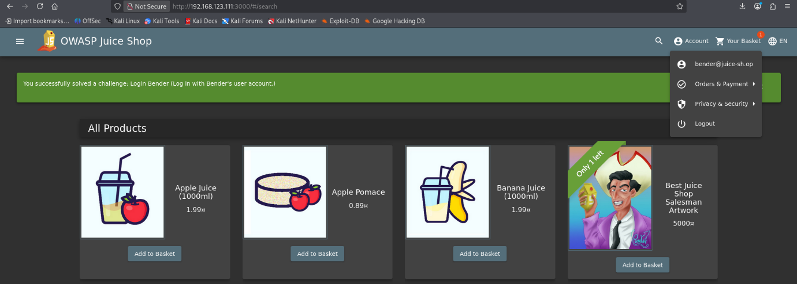

### Step 2: Attempt to change password so you can get the http history in burp suite

Figure 59 - Random Password Entered

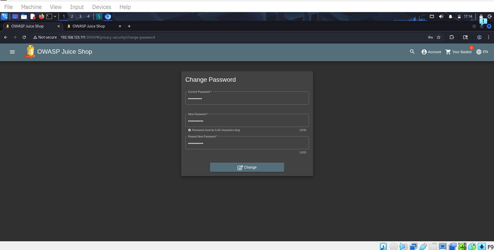

Figure 60 - Login Attempt Caught

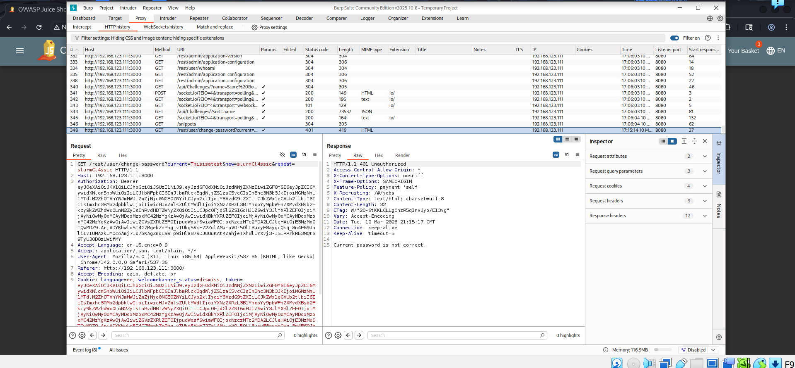

### Step 3: copy the request into the repeater so it can be used again.

Figure 61 - Login attempt is in the Repeater

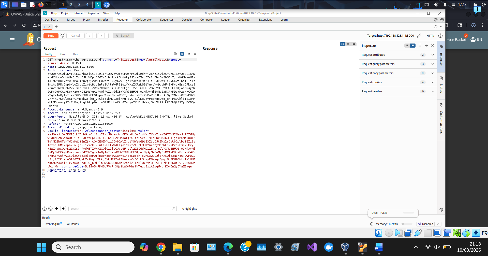

### Step 4: remove the field that says “current” which contains the password you entered and send the request

Figure 62 - "Current" Field has been removed

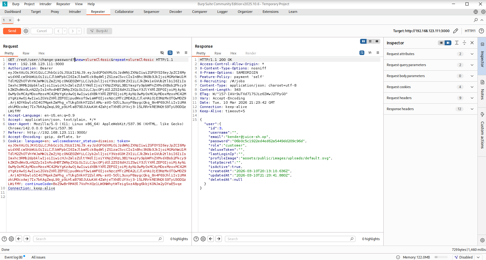

### Proof of completion

Figure 63 - Challenge Completed

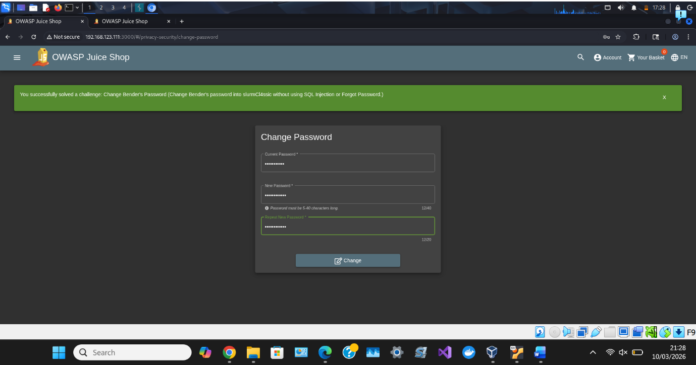

Proof password Changed

Figure 64 - Save Password Box shows Updated Password

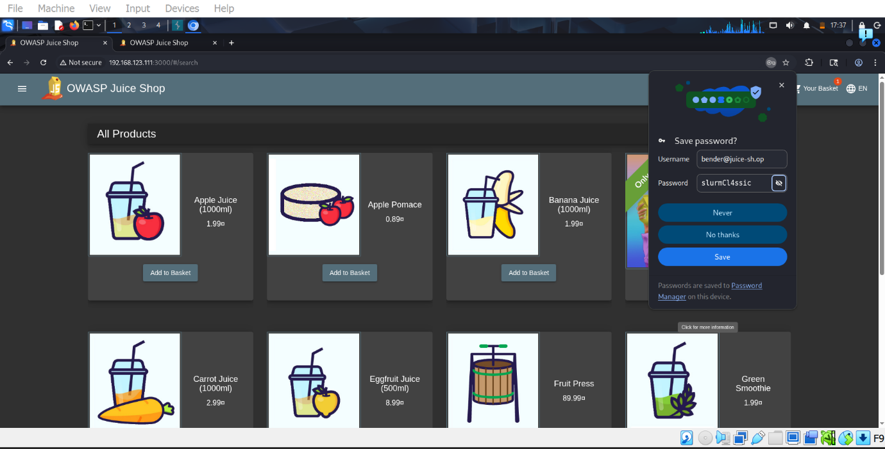

## Exercise 8 CIA Triad Impact

| Confidentiality - Breached | Integrity – Breached | Avaliability - Indirect |
| --- | --- | --- |
| Attacker has Permanent access to account until user notices and changes password | Attacker can make purchases and impersonate the user. | Attacker owner is completely locked out and they must contact support to recover their password |

## Challenge 9: 

Figure 65 – Challenge 9: DOM XSS

### Step 1: Copy the “iframe” code

Figure 66 - Iframe Code Copied

### Step 2: Paste the code into the search bar and then press enter

Figure 67 - Iframe Code Pasted in Search Bar

### Step 3: After you press enter a box saying xss should come up. This tells you the attack was successful

Figure 68 - XSS Attack Output

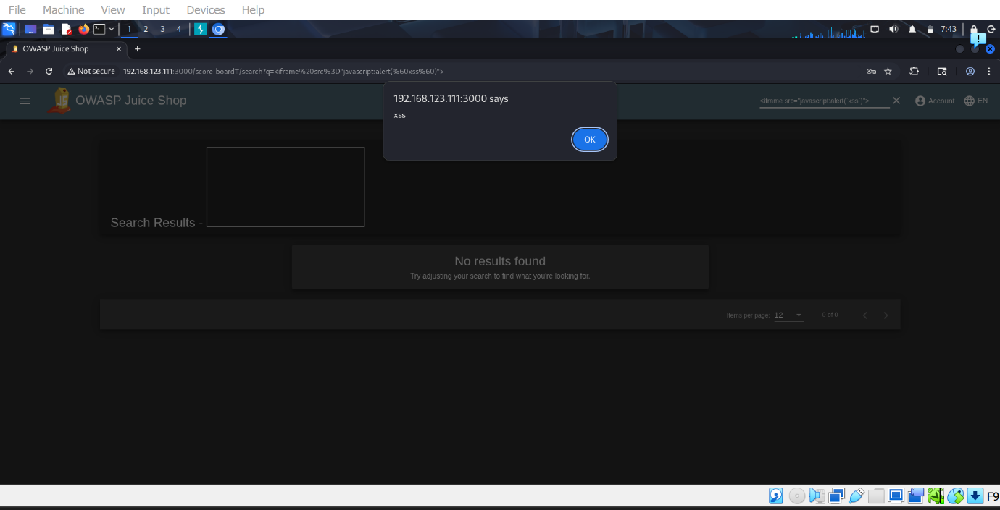

Notice how the search result is a large empty box

Figure 118 - Empty search result box shown after submitting the payload

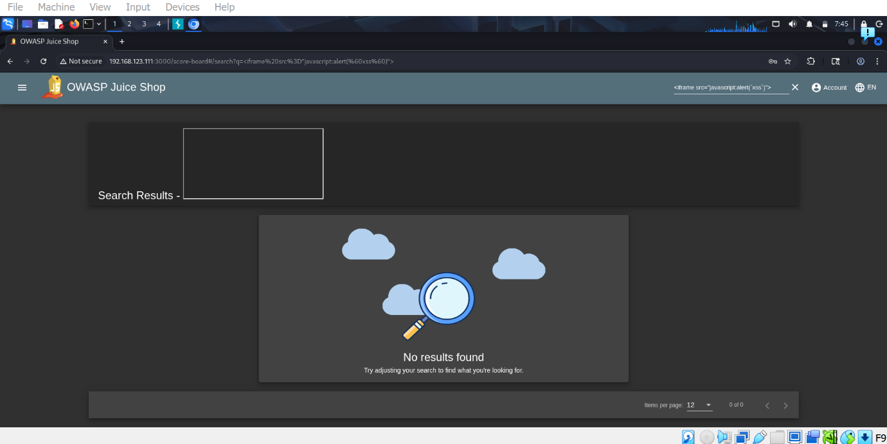

### Proof of completion

Figure 69 - Challenge Completed

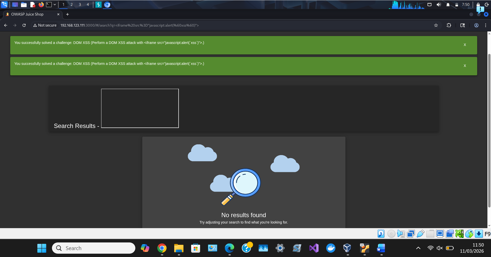

## Exercise 9 CIA Triad Impact

| Confidentiality - Breached | Integrity – Breached | Avaliability - Risk |
| --- | --- | --- |
| A real XSS Payload could steal victims session cookie and hijack the account. | Attacker gains the ability to modify content and submit forms. | Could execute denial of service payloads or lure users away from the site |

## Challenge 10: 

Figure 70 - Challenge 10: Steal User Credentials

### Step 1: In the search bar, do a union select of the user’s table. The page should give information saying that we don’t have the right number of columns

Figure 71- Union Select SQL Injection

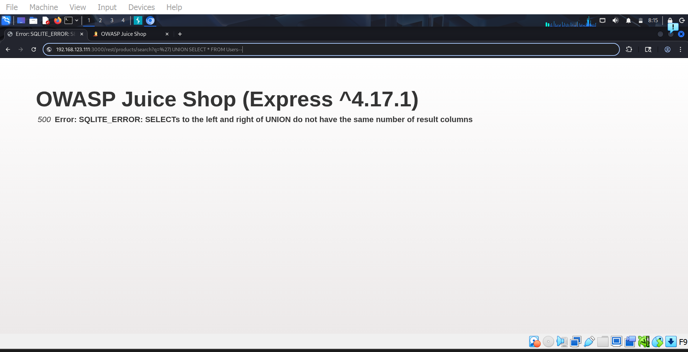

Figure 72- Page Showing the number of columns is incoreect

### Step 2: Find the correct number of columns by increasing the number of columns you are searching for

Figure 73- Selecting 1 column

Figure 74- Error Message Changed

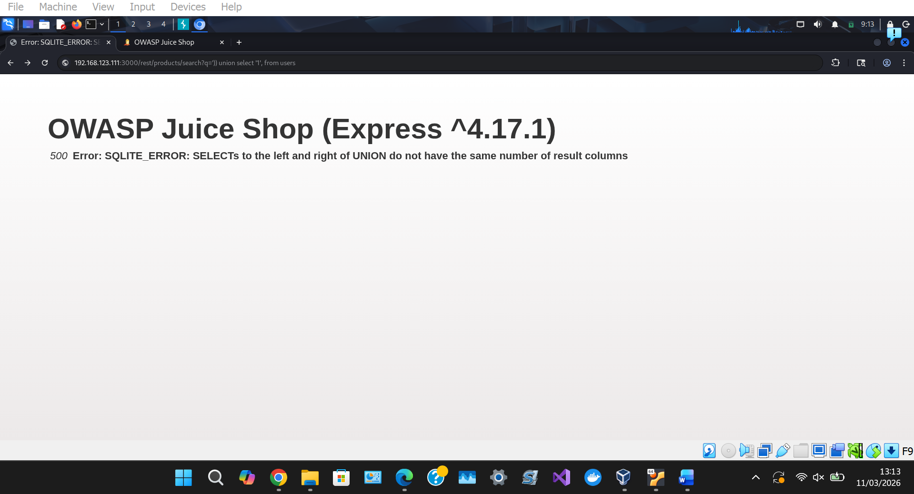

### Step 3: Once you find the right number of columns, a page page containing all the details of a user should appear. 

Figure 75- Selecting 9 Columns is the correct amount of Columns

Figure 76 - Page showing user information

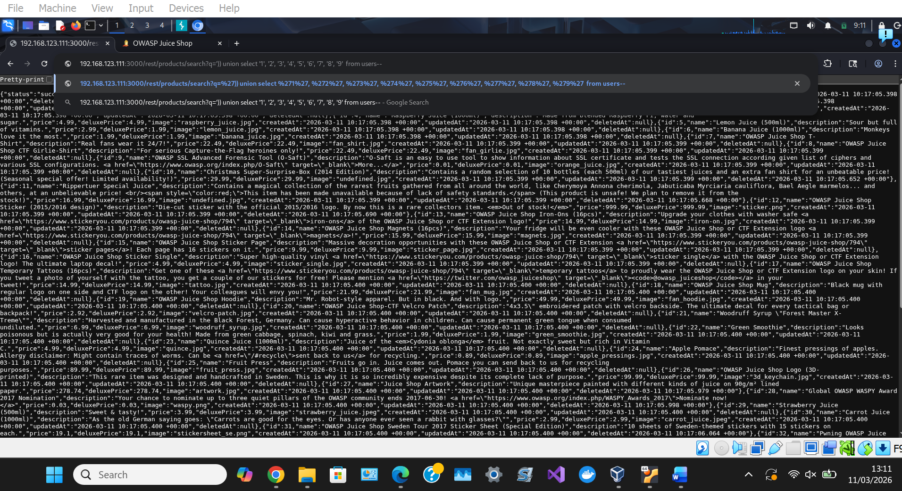

### Step 4: type a sql query in the url that targets id,password and email. This will return a list of user id’s, their emails and passwords

http://192.168.123.111:3000/rest/products/search?q=qwert”)) union select from id, email, password, ‘4’, ‘5’, ‘6’, ‘7’, ‘8’, ‘9’ from users--

Figure 77- SQL Injection Targeting Email, ID and Password

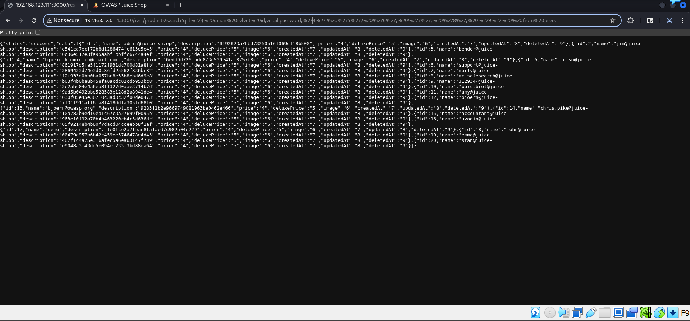

Figure 78 - Output of the SQL injection

### Proof of completion

Figure 79 - Challenge Completed

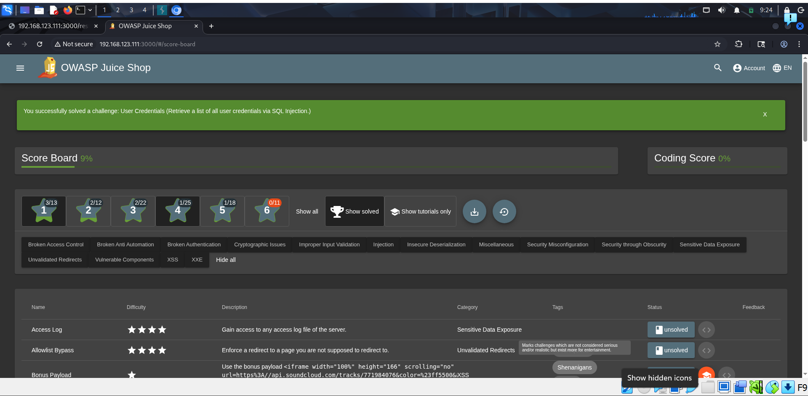

## Exercise 10 CIA Triad Impact

| Confidentiality - Breached | Integrity – At Risk | Availability – High Risk |
| --- | --- | --- |
| Every users email and password is extracted | High risk of taking over accounts and purchases could be modified. | Forces juice shop to reset all passwords. |

List of all completed challenges

Figure 80 - Challenges

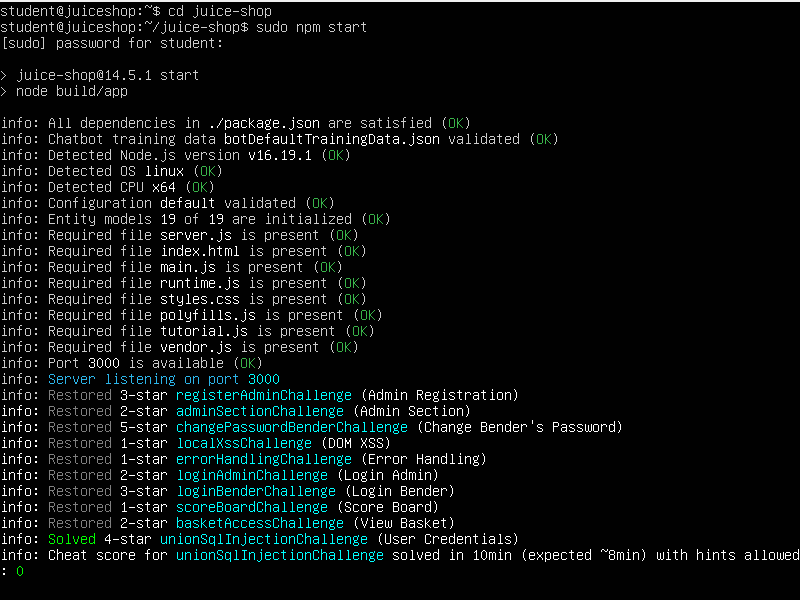

## Reflection

Although Juice shop is not an effective tool in protecting user data, it is an effective tool for providing practical exercises on exploiting multiple types of vulnerabilities and teaches how to identify them.  The Most difficult part of the lab was stealing user credentials (Challenge 10) because it required iterative column counts before the final query could be created. The SQL error messages were helpful as the information disclosure provided clues on what the problem was and how to solve it. This demonstrated that information disclosure and SQL Injections are not disconnected but connected problems that increase the severity of each other. BurpSuites repeater was used in some of the challenges and taught how to modify a sent request and observer the servers response without the browser re-validating input forms which mirrors how professional penetration testers operate.

Strengths and weaknesses

The gamified scoreboard shows instant confirmation when a challenge is completed, and each challenge is categorized based on not just the difficulty rating but the type of vulnerability that is being exploited which allows skills to be built progressively. Juice Shop is very exaggerated in its security design due real world applications not having simultaneous vulnerabilities without being discovered previously.
